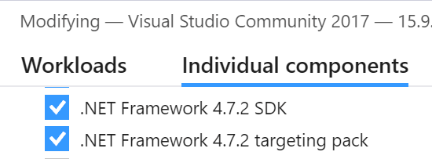

## Requirements
* VL.Xenko repo access on GitHub
* teamcity.vvvv.org login to download the nuget packages
* [Visual Studio 2019 Community](https://visualstudio.microsoft.com/vs/)
  * Make sure to also include .NET Framework 4.7.2 SDK and target pack

* [Xenko](https://xenko.com/download/)

## Scenarios
* [Run the VL.Xenko default game](Run-VL.Stride-default-game.md)
* [Use VL.Xenko as nuget in custom game](Use-VL.Stride-as-nuget-in-custom-game.md)

## Additional Tools
These tools greatly improve the workflow with Xenko: [Additional Tools](Additional-Tools.md)