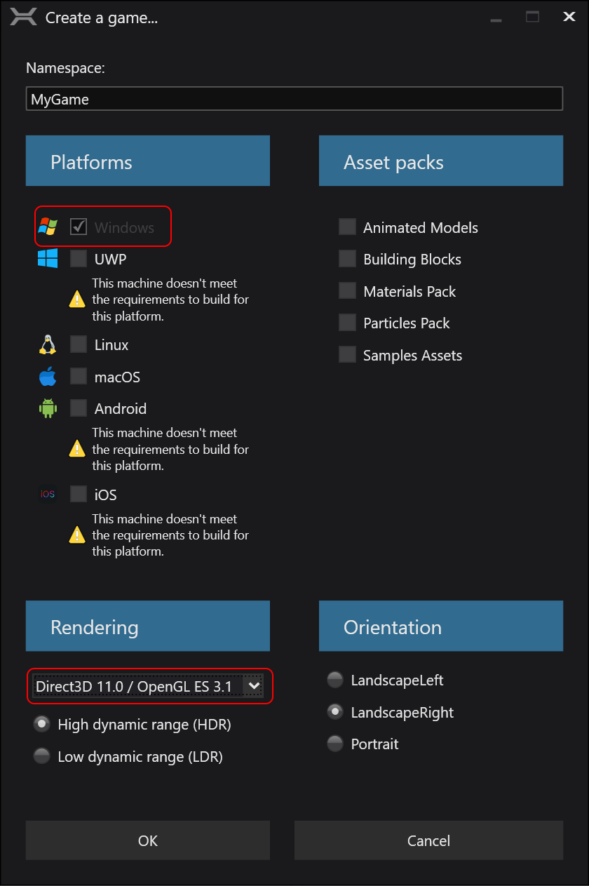

## Install Xenko
* Before running the Xenko launcher, edit the file **%AppData%\NuGet\NuGet.Config** to add the vvvv nuget feed:
```xml
<add key="vvvv-public-feed" value="http://teamcity.vvvv.org/guestAuth/app/nuget/v1/FeedService.svc/" />
```
* Running the Xenko launcher now shows the vvvv builds of Xenko
* Install the Xenko 3.2.x build
* Then start the Xenko Game Studio by pressing the red button
<p align="center">

</p>

* Also install the Visual Studio extension

## Setting up a game
This creates your project folder and gives everything a name. For now, we only support Windows platform and DX11 graphics API backend.
* In the Xenko Game Studio create a new game (any template should work, we tested only with "New Game")
* Give it a proper name and set it to windows and DX11.0 / OpenGL ES3.1

<p align="center">

</p>

* Delete all entites except the "Camera" from the MainScene
* Save the game. This creates a visualstudio solution file (.sln)
* Next to this file create a file named "NuGet.config" with the following content:

```xml
<?xml version="1.0" encoding="utf-8"?>
<configuration>
  <packageSources>
    <add key="msbuildtasks" value="http://www.myget.org/F/loresoft/" />
    <add key="vvvv-private-feed" value="http://teamcity.vvvv.org/httpAuth/app/nuget/v1/FeedService.svc/" />
  </packageSources>
</configuration>
```

This gives you access to some msbuildtask nugets we need and the private VL.Xenko nugets

## Add VL to the game
This adds the VL patch editor and custom features to your game.
* Open the .sln which Game Studio created, in Visual Studio
* Note: The solution has two projects
  * {ProjectName} -> the main game
  * {ProjectName}.Windows -> platform specific code
* Change the {ProjectName}.Windows project to net 4.7.2
  * Rightclick the project -> Properties: set framework 4.6.1 to 4.7.2 and save
* Make sure the 64bit platform gets started
  * Add this line to the {ProjectName}.Windows project file inside the `PropertyGroup` tag:

`    <RuntimeIdentifier>win-x64</RuntimeIdentifier>`

### Add nugets to the projects
* Rightclick on the projects in the Solution and click: Manage NuGet Packages
  * {ProjectName} project: add the VL.Xenko nuget (brings the nodelibrary and shaders)
  * {ProjectName}.Windows project: add the VL.Xenko.Integration nuget (brings the actual vl editor)
<p align="center">

</p>

### Replace code in {ProjectName}App.cs of the {ProjectName}.Windows project
And replace {ProjectName} with the actual name of your project.
This will load the VL editor with the game:

```csharp
using System;
using Xenko.Engine;
using VL.Xenko;

namespace {ProjectName}.Windows
{
    class {ProjectName}App
    {
        [STAThread]
        static void Main(string[] args)
        {
            using (var game = new VLGame())
            {
                game.AttachVL(VLScript.MainVLDocSrc);
                game.Run();
            }
        }
    }
}
```

## Add VL.Xenko lib to Main.vl document
This step makes all nodes and features we developed for Xenko available in the VL documents of your new project.

* In the started game you should see the VL editor with Main.vl open
* Under Dependencies in the document menu:
  * Under VL Nugets: add VL.Xenko
  * Under .NET Nugets: VL.Xenko.EffectLib
* Save Main.vl

## Additional Tools
These tools greatly improve the workflow with Xenko: [Additional Tools](Additional-Tools.md)