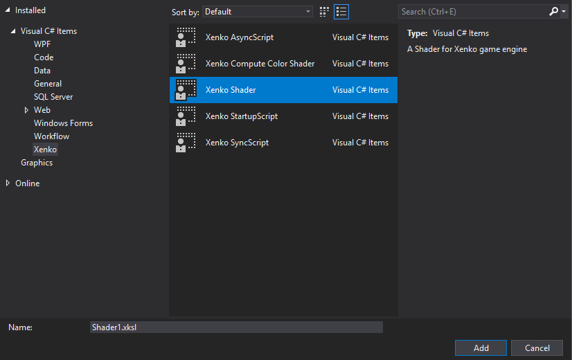

## [Xenko Shader Explorer](https://github.com/tebjan/Xenko.ShaderExplorer/releases)
A standalone software that helps to understand xenkos shaders. It parses the large amount of shaders that come with xenko and shows the inheritance hierarchy and the shader code with syntax highlighting.

## [Xenko Visual Studio Templates](https://github.com/tebjan/XenkoTemplates/releases/)
The most easy way to add a new shader to a game project.

